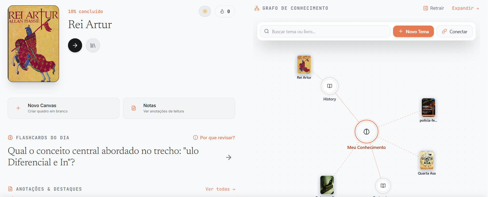
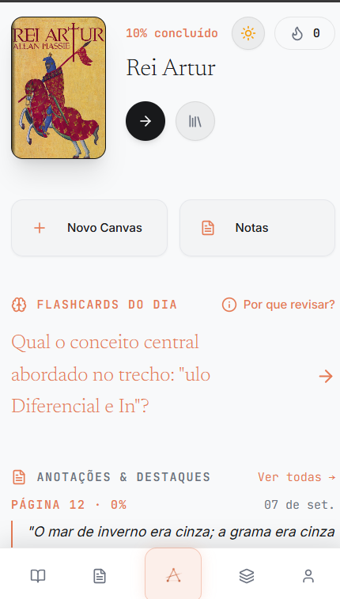

# Aresta — Plataforma Unificada de Leitura, Conhecimento e Notas Visuais

O **Aresta** é um ecossistema integrado para leitura ativa, estudo aprofundado, mapas mentais infinitos e aprendizagem acelerada com repetição espaçada (SM-2) potencializada por IA contextual.

---

## 📸 Demonstração Visual & Interface

| Visão Desktop (Dashboard & Grafo de Conhecimento) | Visão Mobile (Leitura Ativa & Navegação) |
| :---: | :---: |
|  |  |

---

## 🏛️ Arquitetura do Monólito Modular

O sistema opera em um **Monólito Modular em Duas Camadas** (`apps/api` e `apps/web`):

```
┌───────────────────────────────────────────┐
│           apps/web (Nuxt 3)               │
│  Home / Leitor 3D / Canvas / Flashcards   │
│             Porta: :3000                  │
│       (Empacotado no Tauri v2)            │
└─────────────────────┬─────────────────────┘
                      │ REST / JWT
                      ▼
┌───────────────────────────────────────────┐
│           apps/api (Express)              │
│   Auth / Reader / Canvas / Memory / AI    │
│             Porta: :3001                  │
└─────────────────────┬─────────────────────┘
                      │ Prisma ORM
                      ▼
┌───────────────────────────────────────────┐
│         PostgreSQL 16 + pgvector          │
│            Porta: :5432                   │
└───────────────────────────────────────────┘
```

---

## 🧠 Arquitetura de Inteligência Artificial Contextual

O ecossistema de IA do Aresta é desenhado com uma estratégia **híbrida (Local-First + Backend Monolítico + Google Gemini SDK + pgvector)**, garantindo resiliência offline e execução com fallbacks determinísticos.

```
+===================================================================================+
|                                    ARESTA MONOLITH                                |
+===================================================================================+
|                                                                                   |
|  [ FRONTEND / CLIENT ] (apps/web - Nuxt 3 / Tauri v2 / Vue 3 / Pinia)              |
|  +-------------------------------------+  +-------------------------------------+ |
|  |           Didactic Reader           |  |          Handwriting / OCR          | |
|  |    (DidacticDocumentAdapter.ts)     |  |       (HandwritingCanvas.vue)       | |
|  +------------------+------------------+  +------------------+------------------+ |
|                     |                                        |                    |
|                     v                                        v                    |
|  +-------------------------------------+  +-------------------------------------+ |
|  |         useDidacticBooklet          |  |           useAnnotations            | |
|  |        (Frontend Composable)        |  |         (Local-First IndexedDB)     | |
|  +------------------+------------------+  +------------------+------------------+ |
|                     |                                        |                    |
+=====================|========================================|====================+
|                     | (HTTP / JWT)                           |                    |
|                     v                                        v                    |
+===================================================================================+
|  [ BACKEND / MONOLITH CORE ] (apps/api - Express / TypeScript / Prisma)           |
|                                                                                   |
|  +-----------------------------------------------------------------------------+  |
|  | MODULE: ai (apps/api/src/modules/ai)                                        |  |
|  | - config/gemini.config.ts  -> Instâncias dedicadas de GoogleGenerativeAI    |  |
|  | - services/ai.service.ts   -> embed(), generateFlashcard(), didactic(),     |  |
|  |                               translate(), summarize()                      |  |
|  | - routes/ai.routes.ts      -> /api/ai/* protegidas por JWT                  |  |
|  +-------------------------------------+---------------------------------------+  |
|                                        |                                          |
|  +-------------------------------------+---------------------------------------+  |
|  | MODULE: memory (apps/api/src/modules/memory)                                |  |
|  | - services/annotation.service.ts      -> Disparo de embeddings assíncronos   |  |
|  | - services/didacticBooklet.service.ts -> Orquestração pedagógica e capítulos|  |
|  | - services/flashcard.service.ts       -> Algoritmo SM-2 Spaced Repetition   |  |
|  +-------------------------------------+---------------------------------------+  |
|                                        |                                          |
+========================================|==========================================+
|                                        v                                          |
|  [ PERSISTÊNCIA & BANCO DE DADOS ] (PostgreSQL 16 + pgvector)                     |
|  +-----------------------------------------------------------------------------+  |
|  | - annotations.embedding (vector(1536)) -> Busca vetorial por similaridade   |  |
|  | - didactic_booklets & chapters         -> Livros virtuais didáticos         |  |
|  | - flashcards & daily_deck_cards        -> Fila de repetição espaçada        |  |
|  +-----------------------------------------------------------------------------+  |
+===================================================================================+
```

---

## 🔄 Fluxos Detalhados de IA

### 1. Embeddings Vetoriais & Busca Semântica (`pgvector`)

Vetorização não bloqueante (*fire-and-forget*) de anotações com modelo `text-embedding-004` (1536 dimensões) e indexação por distância de cosseno:

```
[ Usuário grifa trecho no Leitor ]
                |
                v
     ( POST /api/annotations )
                |
                +---> 1. Salva anotação no PostgreSQL (Instantâneo)
                |
                +---> 2. Background: POST /api/ai/embed (Fire & Forget)
                             |
                             v
                     [ Gemini text-embedding-004 ]
                             |
                             v Retorna vetor 1536d
                             |
                     [ UPDATE annotations SET embedding = :vector::vector ]
                             |
                             v
                     [ Busca Semântica Pronta: 1 - (a.embedding <=> b.embedding) ]
```

---

### 2. Geração de Flashcards & Algoritmo SM-2

Geração estruturada de perguntas e respostas (`CONCEPT_RECALL`, `REAL_SITUATION`, `CONCEPT_UNION`) integrada ao ciclo de memorização espaçada:

```
+--------------------------+
|  Anotação Selecionada    |
|  - Texto Grifado         |
|  - Nota do Leitor        |
|  - Livro / Capítulo      |
+------------+-------------+
             |
             v
+-------------------------------------------------------------+
| Gemini Flashcard Engine (Structured JSON Prompt)            |
| "You are an expert at creating effective flashcards..."     |
+------------+------------------------------------------------+
             |
             v
+-------------------------------------------------------------+
| Output JSON:                                                |
| { "question": "...", "answer": "...", "contextSummary": ...}|
+------------+------------------------------------------------+
             |
             v
+-------------------------------------------------------------+
| Algoritmo SM-2 (FlashcardService)                           |
| - Dificuldade Inicial: 2.5                                  |
| - Intervalos: 1 dia -> 6 dias -> (interval * difficulty)    |
| - Próxima Revisão: Calculada e inserida no Daily Deck       |
+-------------------------------------------------------------+
```

---

### 3. Gerador de Livretos Didáticos & Leitor 3D

Transformação de conceitos complexos em livros virtuais com analogias âncora, princípios fundamentais e diagramas Mermaid renderizados nativamente no leitor:

```
+------------------------------------------------------------------------------+
|                     FLUXO DO LIVRETO DIDÁTICO GERADO POR IA                  |
+------------------------------------------------------------------------------+

 [ Usuário seleciona tópico ou flashcard ]
                    |
                    v
 [ POST /api/didactic/booklets ]
                    |
                    v
 [ Didactic AI Tutor (Gemini com System Prompt Especializado) ]
                    |
                    +--> Gera Markdown Estruturado:
                    |    • > [!ANALOGY]
                    |    • > [!KEY_CONCEPT]
                    |    • ```mermaid flowchart ... ```
                    |    • > [!TIP] / > [!WARNING]
                    |
                    v
 [ Salva no PostgreSQL: DidacticBooklet + DidacticBookletChapter ]
                    |
                    v
 [ Abre no Leitor Aresta via DidacticDocumentAdapter ]
                    |
                    +--> Paginação virtual mobile por blocos `---`
                    +--> Converte Callouts para componentes visuais estilizados
                    +--> Inicializa `mermaid.run()` para desenhar SVGs dinâmicos
                    +--> Suporta Anotações com data-anchor `didactic://c1/p2#b1`
```

---

### 4. Reconhecimento de Escrita Manual / Inking (OCR Pipeline)

Binarização de alta fidelidade de traços de stylus/touch (traços pretos sólidos sobre fundo branco) para indexação e transcrição automática:

```
+----------------------------+
| Usuário desenha com Stylus |
+--------------+-------------+
               |
               v
+----------------------------------------------------+
| HandwritingCanvas.exportForOcr()                   |
| - Limiar de alfa > 20                              |
| - Traços -> #000000 (Preto sólido)                 |
| - Fundo -> #FFFFFF (Branco puro)                   |
| - Detecção de desenho vazio (< 15 pixels)          |
+--------------+-------------------------------------+
               |
               v
+----------------------------------------------------+
| Base64 PNG de Alta Fidelidade                      |
| (Pronto para processamento via Multimodal / Vision)|
+----------------------------------------------------+
```

---

## 🚀 Como Executar

### 1. Pré-requisitos
- Node.js 20+
- Docker & Docker Compose
- NPM

### 2. Subir o Banco de Dados
```bash
npm run db:up
```

### 3. Iniciar o Ambiente de Desenvolvimento
```bash
npm run dev
```
- **Web App / Desktop:** [http://localhost:3000](http://localhost:3000)
- **API REST:** [http://localhost:3001](http://localhost:3001)

### 4. Executar Bateria de Testes
```bash
npm test
```

### 5. Compilar para Produção
```bash
npm run build
```

### 6. Executar Versão Desktop (Tauri v2)
```bash
npm run tauri:dev
```
