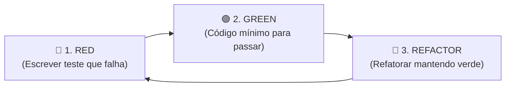

# Guia de Desenvolvimento com TDD (Test-Driven Development)

Este projeto adota o **TDD (Test-Driven Development)** como prática padrão de desenvolvimento e garantia de qualidade de código.

---

## 🚀 O Ciclo Red-Green-Refactor

Todo desenvolvimento de funcionalidade ou correção de bug **deve** seguir as três etapas do ciclo TDD:

### 1. 🔴 RED
* Escreva um teste automatizado descrevendo o comportamento esperado.
* Execute o teste e garanta que ele falhe.

### 2. 🟢 GREEN
* Escreva o código estritamente necessário para fazer o teste passar.
* O foco aqui é velocidade e correção funcional básica.

### 3. 🔵 REFACTOR
* Melhore o design, abstrações e performance do código.
* Garanta a conformidade com **SOLID** e **Clean Code**.
* Execute a suíte de testes para confirmar que nada quebrou.

---

## 📐 Boas Práticas do Projeto

1. **Código Limpo e Sem Comentários**: O código deve ser autoexplicativo através de boa nomenclatura de métodos e variáveis. Não utilize comentários (`//` ou `/* */`).
2. **Nomes de Testes Expressivos**: Nomes de métodos de teste devem deixar claro o cenário e o comportamento esperado.
3. **Padrão AAA (Arrange, Act, Assert)**: Organize os testes em preparação, execução e verificação.
