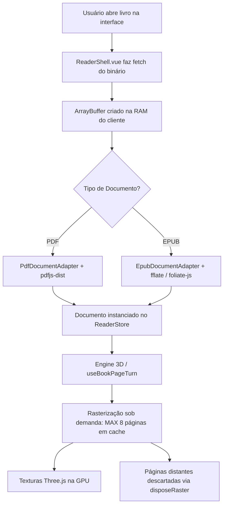

# Arquitetura do Leitor & Gerenciamento de Memória

Esta documentação detalha o funcionamento interno do leitor digital do **Aresta**, explicando como arquivos nos formatos **PDF** e **EPUB** são carregados, processados e gerenciados em memória RAM e GPU durante a leitura, além de apresentar a ferramenta de **Profiling e Diagnóstico de Performance**.

---

## 1. Resumo Executivo: O livro é carregado todo na memória?

* **Arquivo bruto (Binário/Buffer)**: **Sim**. O arquivo do livro (PDF ou EPUB) é baixado por completo e mantido em memória como um `ArrayBuffer` no cliente para viabilizar navegação instantânea, consultas de metadados e suporte a leitura fluida.
* **Renderização visual (Imagens/Texturas 3D)**: **Não**. As páginas **não** são todas rasterizadas ou desenhadas na memória de uma vez. O leitor utiliza uma técnica de **Lazy Loading com Janela Deslizante de Cache**, mantendo em memória visual apenas as páginas atualmente visíveis e suas vizinhas imediatas (máximo de 8 páginas).

---

## 2. Ciclo de Vida do Carregamento



---

## 3. Detalhamento por Camada

### 3.1. Camada de Transporte e Buffer (`ReaderShell.vue`)
Ao iniciar a leitura (`front/app/components/reader/ReaderShell.vue`), o cliente faz uma requisição HTTP para o endpoint de mídia (`/api/books/:id/file`) e obtém o conteúdo bruto em um `ArrayBuffer`:

```typescript
const res = await fetch(fileUrl)
const arrayBuffer = await res.arrayBuffer()
const doc = createBookDocument(type)
await doc.load(arrayBuffer, title)
store.setDocument(doc, title, bookId)
```

### 3.2. Adaptadores de Documento (`IBookDocument`)

#### A. PDF (`PdfDocumentAdapter.ts`)
* Utiliza a biblioteca `pdfjs-dist` com Web Worker dedicado (`pdf.worker.min.mjs`).
* O PDF.js analisa a árvore de objetos e fontes do documento sem decodificar todas as páginas para bitmap simultaneamente.
* A decodificação de cada página (`pdfPage.render()`) só é disparada sob demanda quando a página entra no raio de visualização do leitor.

#### B. EPUB (`EpubDocumentAdapter.ts`)
* Utiliza a biblioteca `fflate` (`unzipSync`) para descompactar o contêiner ZIP do EPUB na memória do navegador.
* O parser do `foliate-js` mapeia os capítulos e seções lineares (`spine`).
* As seções XHTML são convertidas em canvas/SVG e texturas apenas quando o usuário navega até elas.

---

## 4. Motor de Renderização & Gestão de GPU (`useBookPageTurn.ts`)

A visualização e o efeito de folheamento tridimensional (Page Curl) são executados via **Three.js** e WebGL (com fallback para Canvas 2D). Para garantir consumo estável de memória mesmo em livros com milhares de páginas:

### 4.1. Janela Deslizante de Cache
O leitor define um limite estrito de páginas mantidas na memória gráfica (`MAX_CACHED_PAGES = 8`):

```typescript
const MAX_CACHED_PAGES = 8
const rasterCache = new Map<number, PageRaster>()

function retainRasters() {
    const retainedPages = new Set([
        renderedPage,
        renderedPage + 1,
        store.currentPage - 2,
        store.currentPage - 1,
        store.currentPage,
        store.currentPage + 1,
        store.currentPage + 2,
        store.currentPage + 3,
    ])

    for (const [pageNumber, raster] of rasterCache) {
        if (rasterCache.size <= MAX_CACHED_PAGES || retainedPages.has(pageNumber)) continue
        rasterCache.delete(pageNumber)
        disposeRaster(raster)
    }
}
```

### 4.2. Descarte de Texturas e Liberação de Recursos
Quando uma página sai da janela de leitura ativa, a função `disposeRaster()` limpa os recursos alocados:
* `texture.dispose()` e `backTexture.dispose()` desalocam as texturas da GPU.
* O tamanho do `<canvas>` auxiliar é reduzido para 1x1 pixel (`canvas.width = 1; canvas.height = 1`) para que o Garbage Collector do JavaScript libere a memória imediatamente.

---

## 5. Matriz de Consumo de Recursos

| Componente | Armazenamento | Ciclo de Vida | Impacto de Memória |
| :--- | :--- | :--- | :--- |
| **Binário do Arquivo** | RAM (JavaScript Heap) | Durante toda a sessão de leitura do livro | Proporcional ao arquivo (ex: ~2MB a 30MB) |
| **Estrutura/DOM do Livro** | RAM (Heap) | Durante a sessão | Baixo (~1MB a 5MB) |
| **Texturas WebGL (Three.js)** | VRAM (GPU) | Máx. 8 páginas simultâneas | Constante (~15MB a 40MB na GPU) |
| **Páginas Não Visualizadas** | N/A (Descarregadas) | Não alocadas até serem acessadas | 0 MB adicionais |

---

## 6. Ferramenta de Profiling e Diagnóstico de Gargalos (`readerProfiler`)

Para descobrir com precisão onde está o tempo gasto ao abrir qualquer livro, foi implementado o `readerProfiler` ([`front/app/utils/readerProfiler.ts`](file:///home/bcc/vhwcm24/Aresta/front/app/utils/readerProfiler.ts)).

### 6.1. O que é medido automaticamente:
1. **1. Buscar Metadados da API** (`network`): Tempo da requisição HTTP `/api/books/:id`.
2. **2. Download do Arquivo** (`network`): Tempo de transmissão HTTP do binário do livro (`/api/books/:id/file`).
3. **3. Conversão para ArrayBuffer** (`io`): Tempo de transferência dos bytes para o buffer em memória.
4. **4. Parsing do Documento** (`parse`):
   - Importações dinâmicas (`pdfjs-dist`, `fflate`, `foliate-js`).
   - Descompactação ZIP e parsing de estrutura.
   - Extração de metadados e contagem de páginas.
5. **5. Atualização da Store** (`store`): Tempo de reatividade do Pinia e inicialização de marcadores.
6. **6. Renderização da 1ª Página** (`render` / `webgl`):
   - Rasterização Canvas 2D da página 1.
   - Geração de texturas WebGL Three.js e envio para a GPU.
   - Exibição do primeiro frame interativo.

### 6.2. Como inspecionar no Navegador:
* Ao abrir um livro em ambiente de desenvolvimento (ou com `localStorage.setItem('aresta_debug_profiler', 'true')`), o console do navegador exibirá automaticamente um relatório colapsado com tabela detalhada:
  ```text
  ⚡ [Aresta Reader Profiler] Abrir Livro (ID: 3) — Total: 840ms
  Tempo Total até a 1ª Página: 840ms
  ┌─────────┬──────────────────────────────────────────┬───────────┬──────────────┬────────────┐
  │ (index) │ Etapa / Função                           │ Categoria │ Duração (ms) │ % do Total │
  ├─────────┼──────────────────────────────────────────┼───────────┼──────────────┼────────────┤
  │ 0       │ 1. Buscar Metadados da API               │ NETWORK   │ 15ms         │ 1.8%       │
  │ 1       │ 2. Download do Arquivo (HTTP Fetch)      │ NETWORK   │ 420ms        │ 50.0%      │
  │ 2       │ 3. Conversão para ArrayBuffer            │ IO        │ 25ms         │ 3.0%       │
  │ 3       │ 4. Parsing e Inicialização do Documento  │ PARSE     │ 210ms        │ 25.0%      │
  │ 4       │ 6. Renderização da 1ª Página (Canvas)    │ RENDER    │ 110ms        │ 13.1%      │
  │ 5       │ 6.3 Criar Texturas Three.js              │ WEBGL     │ 60ms         │ 7.1%       │
  └─────────┴──────────────────────────────────────────┴───────────┴──────────────┴────────────┘
  ⚠️ Gargalos Identificados:
    1. [NETWORK] 2. Download do Arquivo: 420ms (50% do tempo)
       💡 Sugestão: Download demorou 420ms. Considere pré-carregamento (prefetch), compressão brotli/gzip ou cache HTTP/IndexedDB.
  ```

* Você também pode inspecionar o último relatório via objeto global:
  ```javascript
  window.__ARESTA_READER_PROFILE__
  ```
